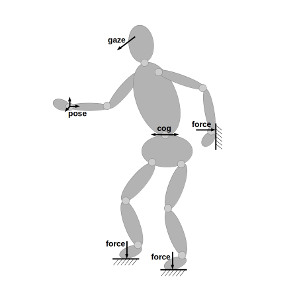

# WBC Documentation

### [Code API](http://buildsrv01/apis/dfki-control/wbc/)

WBC (Whole Body Control) is an approach for specifying and controlling complex robotic tasks based on *constraints*. 
The term was coined by Luis Sentis in his phd thesis 
[Synthesis and Control of Whole-Body Behaviors in Humanoid Systems](http://citeseerx.ist.psu.edu/viewdoc/download?doi=10.1.1.73.8747&rep=rep1&type=pdf). 
However, it is not limited to humanoid robot control, but can be 
used for arbitrary robot control tasks like dual arm grasping, force-position control, mobile manipulation. 

The fundamental idea is to break down the overall control problem into multiple, simultaneously running subtasks. Each subtask is described as a *constraint* to an optimization problem.
Now, in each control cycle ...
  * The constraints are updated with the current robot state
  * The optimization problem is solved and ...
  * The solution is applied to the actuators of the robot
  
An advantage of this approach is that complex tasks can be composed from low-dimensional descriptors (aka constraints), which are typically 
easier to specify and control than the complete task are once. Also, the redundancy of the robot is exploited automatically utilizing 
all the dof of the system (whole body). 

See also [here](https://git.hb.dfki.de/wbc/documentation/wikis/home) for a more extensive documentation WBC usage under Rock.

