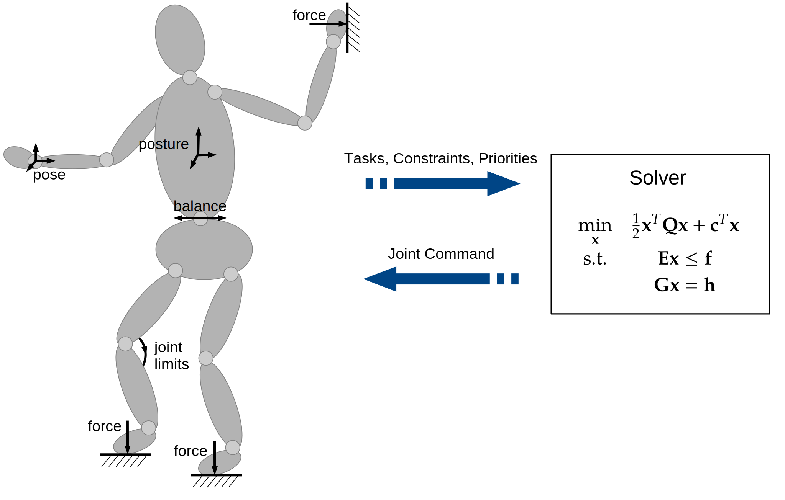

[](https://github.com/ARC-OPT/wbc/actions/workflows/build_and_test_ubuntu20.04.yml)
[](https://github.com/ARC-OPT/wbc/actions/workflows/build_and_test_ubuntu22.04.yml)
[](https://github.com/ARC-OPT/wbc/actions/workflows/build_and_test_ubuntu24.04.yml)

[](https://doi.org/10.21105/joss.06696)   
# WBC - Whole-Body Control

[Code API](https://arc-opt.github.io/wbc/index.html)  | [Full Documentation](https://arc-opt.github.io/Documentation/) | [Scientific Paper](https://arc-opt.github.io/Documentation/publications/icra_2022/index.html) | [ROS 2 Interface](https://github.com/ARC-OPT/wbc_ros)



WBC is C++ library for optimization-based control of redundant robots. The idea of WBC is to describe a control problem as costs and constraints of an optimization problem (typically a quadratic program or QP) and design a set of feedback controllers around it. The QP minimizes the control errors, trading off the different objectives and produces a joint space command on velocity, acceleration or torque level, which is applied to the robot actuators. WBC is meant for
* Controlling redundant robots, particularly floating base systems like humanoids or quadrupeds
* Controlling multiple tasks simultaneously
* reactive robot control, i.e. it does not plan ahead the next robot control actions

WBC was initiated and is currently developed at the [Robotics Innovation Center](http://robotik.dfki-bremen.de/en/startpage.html) of the [German Research Center for Artificial Intelligence (DFKI)](http://www.dfki.de) in Bremen. Also see the [ARC-OPT website](https://robotik.dfki-bremen.de/en/research/softwaretools/arc-opt/) of the Robotics Innovation Center.


## How does it compare to other WBC libraries?

There are multiple other libraries for Whole-Body Control, e.g., [TSID](https://github.com/stack-of-tasks/tsid) or [ControlIt!](https://github.com/liangfok/controlit). Compared to these, the ARC-OPT Whole-Body Control library provides various WBC implementations on velocity, acceleration, and torque level. It is modular as it separates modeling, QP problem specification, and solving, allowing to evaluate and benchmark different robot models, QP solvers, and various WBC implementations. Furthermore, it implements a WBC approach for robots with closed-loop structures as described in this [paper](https://arc-opt.github.io/Documentation/publications/icra_2022/index.html) (will be made open-source soon).

## Requirements / Dependencies

Currently supported OS: Ubuntu20.04, Ubuntu22.04, Ubuntu24.04

See the [manifest.xml](https://github.com/ARC-OPT/wbc/blob/master/manifest.xml) for required and optional dependencies. 

## ROS 2 Interface

ROS 2 support for the WBC library can be found [here](https://github.com/ARC-OPT/wbc_ros)

## Installation

### Basic Install

This will install the WBC core library with a single robot model (pinocchio) and QP solver (qpoases) respectively. Download this [install script](https://github.com/ARC-OPT/wbc/blob/master/scripts/install.sh?raw=1), store it in a folder of your choice (e.g., arc-opt) and execute it:

```
mkdir ~/arc-opt && cd ~/arc-opt
wget https://raw.githubusercontent.com/ARC-OPT/wbc/master/scripts/install.sh
sh install.sh
```
### Full Install

This will install the WBC core library plus multiple robot models and solvers. Download this [install script](https://github.com/ARC-OPT/wbc/blob/master/scripts/full_install.sh?raw=1), store it in a folder of your choice (e.g., arc-opt) and execute it:

```
mkdir ~/arc-opt && cd ~/arc-opt
wget https://raw.githubusercontent.com/ARC-OPT/wbc/master/scripts/full_install.sh
sh full_install.sh
```

## Testing

To execute unit tests for the WBC library, run
```
make test
```
from the library's build folder. This will execute unit tests for all installed components, e.g. solvers, robot models, etc...

## Examples 

You can also check the [tutorials](https://github.com/ARC-OPT/wbc/tree/master/tutorials) to for some comprehensive examples.

## Contributing

Please use the [issue tracker](https://github.com/ARC-OPT/wbc/issues) to submit bug reports and feature requests. Please use merge requests as described [here](https://github.com/ARC-OPT/wbc/blob/master/CONTRIBUTING.md) to add/adapt functionality. 

## License

WBC is distributed under the [3-clause BSD license](https://opensource.org/licenses/BSD-3-Clause).

## Acknowledge WBC

If you want to use WBC within your scientific work, please cite [this paper](https://joss.theoj.org/papers/10.21105/joss.06696#) or direcly use the following BibTex entry:

```
@article{Mronga2024,
   author = {Dennis Mronga and Frank Kirchner},
   title = {The ARC-OPT Library for Whole-Body Control of Robotic Systems},
   journal = {Journal of Open Source Software},
   year = {2024},
   doi = {10.21105/joss.06696}
} 
```

## Funding

WBC has been developed in the research projects [TransFit](https://robotik.dfki-bremen.de/en/research/projects/transfit/) (Grant number 50RA1701) and [BesMan](https://robotik.dfki-bremen.de/en/research/projects/besman.html) (Grant number 50RA1216) funded by the German Aerospace Center (DLR) with funds from the German	Federal Ministry for Economic Affairs and Climate Action (BMWK). It is further developed in the [M-Rock](https://robotik.dfki-bremen.de/en/research/projects/m-rock/) (Grant number 01IW21002) and [VeryHuman](https://robotik.dfki-bremen.de/en/research/projects/veryhuman/) (Grant number  01IW20004) projects funded by the German Aerospace Center (DLR) with federal funds from the German Federal Ministry of Education and Research (BMBF).

## Maintainer / Authors / Contributers

Dennis Mronga, dennis.mronga@dfki.de

Copyright 2017, DFKI GmbH / Robotics Innovation Center

