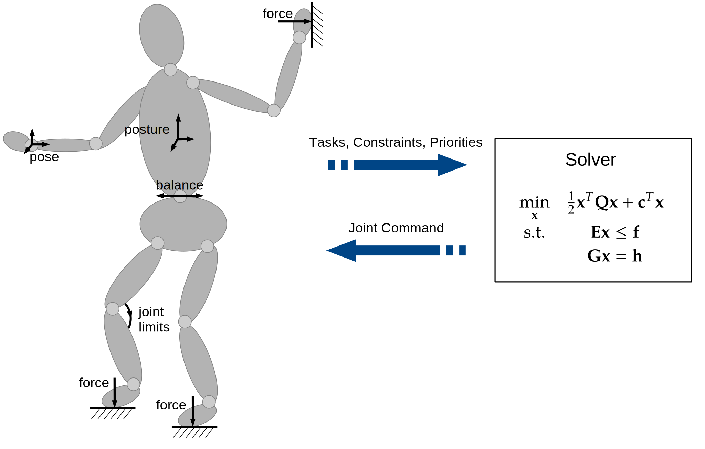

# Introduction

### Whole-Body Control

Whole Body Control (WBC), also referred to as constraint-based or optimization-based control, is an approach for specifying and controlling complex robotic tasks. 
The term was coined by Luis Sentis in his work
[Synthesis and Control of Whole-Body Behaviors in Humanoid Systems](http://citeseerx.ist.psu.edu/viewdoc/download?doi=10.1.1.73.8747&rep=rep1&type=pdf).

Image Credits: Dennis Mronga, DFKI

The idea is define a set of feedback controllers around an optimization problem. Each controller regulates a certain task, the control output is fed into the cost function of the optimization problem, typically a quadratic program, and thus minimized during execution.
In each control cycle ...
  * The cost function is updated with the current robot state and controller reference
  * The optimization problem is solved
  * The solution is applied to the actuators of the robot
  
WBC is used for...
 
  * controlling robots with redundant degrees of freedom, like humanoids or other legged robots with floating base, but also fixed-base systems like mobile manipulators, dual-arm systems or even simple manipulators. In general, the number of robot dof can be arbitraryily high like >50. 

  * controlling multiple tasks simultaneously while taking into account the physical constraints of the robot. E.g., on a humanoid robot do ... (1) keep balance (2) Grasp an object with one arm (3) maintaining an upright body posture (4) Consider the joint torque limits, etc... 

  * reactive robot control, i.e., it does not involve any motion planning or trajectory optimization. However, it can be used to stabilize trajectories coming from a motion planner or trajectory optimizer and integrate them with other objectives and physical constraints of the robot. Other than in MPC, the optimization horizon has the size 1, i.e., there is no prediction model involved. 

###  ARC-OPT: Motivation

ARC-OPT is a framework for optimization-based control of redundant robots. It contains various implementations of whole-body feedback control approaches on velocity-, acceleration- and force/torque-level. The core WBC library is written in C++, with Python bindings for most functionalilities. It aims at facilitating the specification and benchmarking of whole-body controllers for redundant robots, i.e., the target user group are software developers and control engineers. Compared to existing frameworks for optimization-based robot control, ARC-OPT provides

 * A common interface to several WBC approaches on velocity, acceleration, and torque control level, using different solvers and robot models
 * A learning module that allows to automatically derive, adapt, and optimize WBC tasks (will made be open-source soon)
 * An approach for modeling and solving WBC problems on series-parallel hybrid robots, as described in [this paper](publications/icra_2022/index.html)  (will made be open-source soon)
