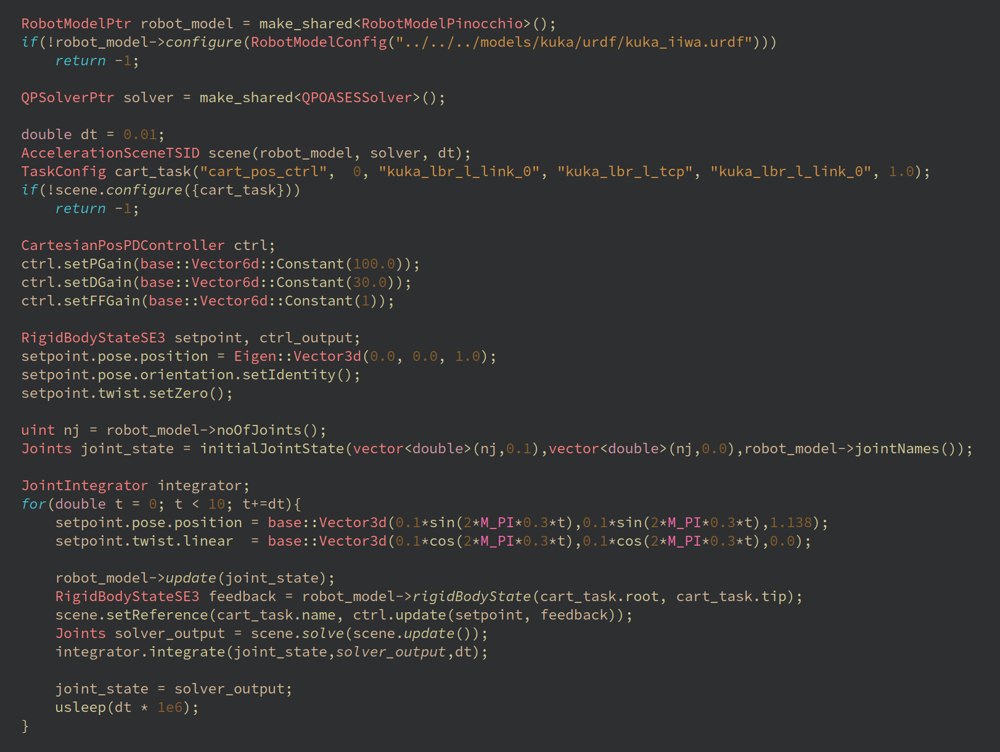
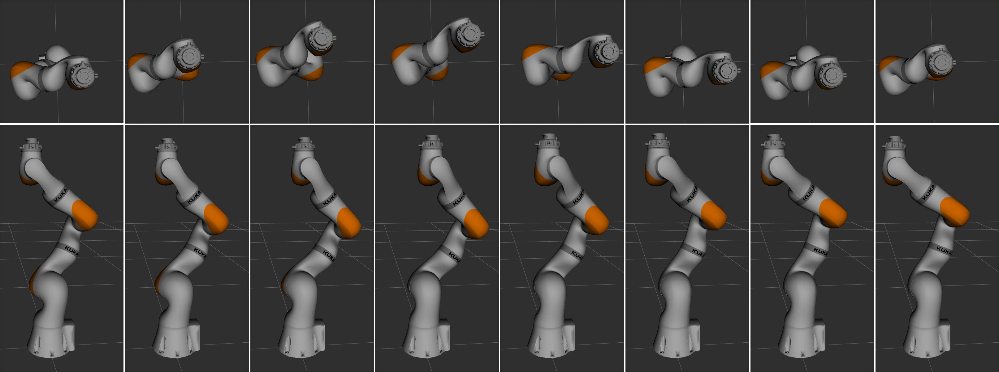

# Summary

ARC-OPT (Adaptive Robot Control using OPTimization) is a C++ library for Whole-Body Control (WBC) [@Sentis2006] of complex robotic systems, such as humanoids, quadrupedal robots, or mobile manipulators.  

In general, WBC describes a robot control problem in terms of costs and constraints of a quadratic program (QP). The cost function thereby minimizes the residuals of multiple feedback controllers, each dedicated to a specific robot task, along with further objectives. In each control cycle, the QP is solved and the solution, which should fulfill all objectives if possible, is sent to the robot's actuators. WBC is a reactive control approach, which targets redundant robots and is able to control multiple tasks simultaneously, like, e.g., grasping and balancing on a humanoid robot.

# Statement of need

ARC-OPT supports the software developer in designing such Whole-Body Controllers by providing configuration options for different pre-defined WBC problems. Today, the methodology of WBC is well understood and several mature frameworks exist. Task Space Inverse Dynamics (TSID) [@delprete2016] implements a control algorithm for legged robots on acceleration level, while the approach presented in [@Posa2016] operates on torque level. In [@Smits2009] a generalized velocity-IK framework is implemented, which is, however, tightly coupled to the Orocos project. Similarly, Pink [@pink2024] is a weighted task-based framework for differential inverse kinematics implemented in Python. The IHCM Whole-Body Controller has been developed for the ATLAS robot [@Feng2015], providing control algorithms for walking and manipulation based on QPs. Drake [@drake2021] is a collection of libraries for model-based design and control of complex robots. It provides interfaces to several open-source and commercial solvers, including linear least-squares, quadratic programming, and non-linear programming. Finally, ControlIt! [@controlit2021] is a middleware built around the whole-body operational space control algorithm first introduced by Sentis and Khatib [@Sentis2006]. 

In contrast to the existing libraries, ARC-OPT implements unified interfaces for different WBC problems on velocity, acceleration and torque level, as well as options to benchmark different QP solvers and rigid body dynamics libraries on these problems. Furthermore, it provides a novel WBC approach for robots with parallel kinematic loops, which is described [@Mronga2022]. 

# Description

Figure \ref{fig:overview} shows an overview of the ARC-OPT library. ARC-OPT separates the implementation of controllers, robot model, solver, and scene, which allows a modular composition of the WBC problem:

* A **controller** implements a function in the robot's task space, e.g., for maintaining balance, avoiding an obstacle, or following a trajectory. ARC-OPT provides various controllers in joint or Cartesian space, like PD-Controllers, or repulsive potential fields.
* The **scene** sets up the QP, where the costs can be configured at runtime, and the constraints are specific for the implemented scene. Different scenes are currently implemented on velocity and acceleration level.
* The **robot model** computes the kinematic and dynamic information that the scene requires to set up the QP, like Jacobians, mass-inertia matrices, and gravity terms. ARC-OPT implements multiple robot models based on Pinocchio [@carpentier2019pinocchio], RBDL [@Felis2016], and Hyrodyn [@2019_Kumar_HyRoDynApproach_IDETC].
* The **solver** solves the QP and generates the required control input for the robot joints. ARC-OPT provides various QP solvers based on open-source implementations, e.g.,  qpOASES [@Ferreau2014], eiquadprog [@Eiquadprog2021], proxQP [@bambade2022], and qpSwift [@pandala2019qpswift].

Apart from this, ARC-OPT implements various concepts typically used in WBC. These include floating base dynamics and friction cone constraints, which are required for walking robots. Furthermore, task weighting and hierarchies can be used to prioritize one task over another. The software provides tutorials explaining most of these concepts.

# Example

This example shows how to set up an acceleration-level WBC. Here, the tasks are formulated in the cost function. Equations of motion, rigid contacts and joint torque limits are implemented as constraints. The decision variables are the joint accelerations $\ddot{\mathbf{q}}$, joint torques $\boldsymbol{\tau}$ and contact wrenches $\mathbf{f}$. Mathematically, this can be expressed by the following QP:

$$\begin{array}{cc}
\underset{\ddot{\mathbf{q}}, \boldsymbol{\tau}, \mathbf{f}}{\text{min}} & \|\sum_i \mathbf{w}_i^T\left(\mathbf{J}_i\ddot{\mathbf{q}} + \dot{\mathbf{J}}_i\dot{\mathbf{q}} - \dot{\mathbf{v}}_{d,i}\right)\|_2 \\
\text{s.t.} & \mathbf{H}\ddot{\mathbf{q}} + \mathbf{h} = \mathbf{B}\boldsymbol{\tau} + \mathbf{J}_c\mathbf{f}  \\
      & \mathbf{J}_{c}\ddot{\mathbf{q}} = -\dot{\mathbf{J}}_c\dot{\mathbf{q}} \\
       & \boldsymbol{\tau}_m \leq \boldsymbol{\tau} \leq \boldsymbol{\tau}_M \\
\end{array}$$

where $\mathbf{w}_i$ are the task weights for the i-th task, $\mathbf{J}_i$ is the respective robot Jacobian, $\dot{\mathbf{v}}_{d,i}$ the desired task space acceleration,  $\mathbf{q},\dot{\mathbf{q}},\ddot{\mathbf{q}}$ the joint positions, velocities, and accelerations, $\mathbf{H}$ the mass-inertia matrix, $\mathbf{h}$ the vector of gravity and Coriolis forces, $\boldsymbol{\tau}$ the robot joint torques, $\mathbf{B}$ the control input matrix, $\mathbf{f}$ the contact wrenches,  $\mathbf{J}_c$ the contact Jacobian,  and $\boldsymbol{\tau}_m,\boldsymbol{\tau}_M$ the joint torque limits. To implement a simple Cartesian position controller for, e.g., controlling the end effector of a robot manipulator, the following PD-controller can be used:

$$
\dot{\mathbf{v}}_d = \dot{\mathbf{v}}_r + \mathbf{K}_d(\mathbf{v}_r-\mathbf{v}) + \mathbf{K}_p(\mathbf{x}_r-\mathbf{x})
$$

where $\mathbf{K}_p,\mathbf{K}_d$ are gain matrices, $\mathbf{x},\mathbf{v}$ the end effector position and velocity, $\dot{\mathbf{v}}_r,\mathbf{v}_r,\mathbf{x}_r$ the reference acceleration, velocity, and position. Figure \ref{fig:snippet} shows a C++ code snippet from ARC-OPT, which implements the above QP on a KUKA iiwa robot arm (no contacts, fixed base robot). In the code example, at first the robot model is set up using the URDF file, then the QP-solver (qpOASES), the WBC scene and a Cartesian controller are configured. In the subsequent control loop, a circular trajectory is tracked in Cartesian space. The full example can be found in the ARC-OPT tutorials\footnote{\url{https://github.com/ARC-OPT/wbc/blob/master/tutorials/kuka_iiwa/cart_pos_ctrl_dynamic.cpp}}. Figure \ref{fig:screenshots} shows a visualization of the resulting robot motion. While this example only implements simple Cartesian control, more complex problems with multiple objectives/controllers can easily be composed, such as tracking the leg positions and center of mass on a walking robot.

# ROS 2 integration and Python Bindings

The WBC library is integrated into ROS 2 using the \textit{ros2\_control} framework. Each WBC controller is represented by a separate ROS 2 controller. Another ROS 2 controller (whole-body controller) integrates the robot model, the WBC scene and the solver. In each control step, the whole-body controller updates the robot model, sets up the costs and constraints of the QP, solves it and sends the solution to the hardware interfaces. Typical control rates for WBC are 500Hz - 1Khz. Most configuration options are exposed as ROS 2 parameters and the WBC problem can be configured according to the user's needs using .yaml configuration files. 

Additionally, Python bindings for most of the library functions are available\footnote{\url{https://github.com/ARC-OPT/wbc_py}}. 

The ARC-OPT library for Whole-Body Control has been used in various scientific works [@Mronga2022],[@Mronga2021],[@Mronga2020],[@Popescu2022], and evaluated on different robots, like, e.g., the RH5 humanoid [@Eer2021DesignAA] shown in Figure \ref{fig:rh5}.

# Acknowledgements

ARC-OPT is supported through grants from the German Federal Ministry of Education and Research (BMBF), grant numbers 01IW21002 (M-Rock project),  01IW20004 (VeryHuman project) and 01IW24008 (CoEx project).

# References
