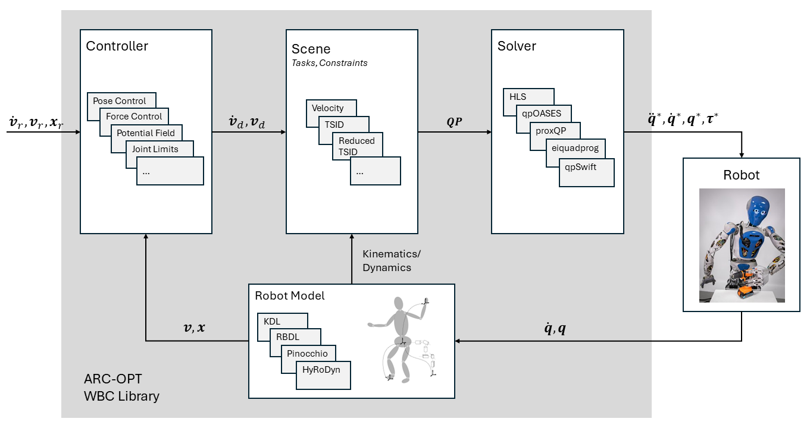

# Summary

ARC-OPT (Adaptive Robot Control using Optimization) is a C++ library for Whole-Body Control (WBC) [@Sentis2006] of complex robotic systems, such as humanoids, quadrupedal robots, or mobile manipulators with one or two arms.  

WBC aims to describe a robot control problem in terms of costs and constraints of a quadratic program (QP) and design a set of feedback controllers around it, each dedicated to a specific robot tasks. In every control cycle, the QP is solved and the solution is applied to the robot's actuators. WBC is a reactive control approach, which targets redundant robots and is able to control multiple tasks simultaneously, like, e.g., grasping and balancing on a humanoid robot. 

# Statement of need

ARC-OPT supports the software developer in designing robot controllers by providing configuration options for different pre-defined Whole-Body Control problems. In contrast to existing libraries for Whole-Body Control [@delprete2016],[@Posa2016] it provides unified interfaces for WBC problems on velocity, acceleration and torque level, as well as options to benchmark different QP solvers and robot model libraries on these problems. Finally, it provides an approach for solving WBC problem on robots with parallel kinematic loops, as described in [@Mronga2022].

# Description

ARC-OPT separates the implementation of controllers, robot models, solvers, and scenes, which allows a modular composition of the Whole-Body Control problem:

* A **controller** implements a function in the robot's task space, e.g., 'maintain balance', 'avoid obstacle', or 'follow trajectory'. ARC-OPT provides various controllers in joint or Cartesian space, like PD-Controllers, or repulsive potential fields. 
* The **scene** sets up the QP, where the costs can be configured at runtime, and the constraints are specific for the implemented scene. Different QPs are currently implemented on  velocity, acceleration and torque level.
* The **robot model** computes the kinematic and dynamic information that the scene requires to set up the QP, like Jacobians, mass-inertia matrices, and gravity terms. ARC-OPT implements various robot models based on Pinocchio [@carpentier2019pinocchio], RBDL [@Felis2016], KDL [@kdl2021], and Hyrodyn [@2019_Kumar_HyRoDynApproach_IDETC].
* The **solver** solves the QP set up by the scene to produce the require control input for the robot. ARC-OPT provides various QP solvers based on open-source implementations, e.g.,  qpOASES [@Ferreau2014], eiquadprog [@Eiquadprog2021], proxQP [@bambade2022], and qpSwift [@pandala2019qpswift].

# Example

Acceleration/torque-level QP: Tasks are formulated within the cost function. Equations of motion, rigid contacts and joint torque limits serve as constraints. The decision variables are the joint accelerations $\ddot{\mathbf{q}}$, joint torques $\mathbf{\tau}$ and contact wrenches $\mathbf{f}$:

$$\begin{array}{cc}
\underset{\ddot{\mathbf{q}}, \boldsymbol{\tau}, \mathbf{f}}{\text{min}} & \|\mathbf{J}\ddot{\mathbf{q}} + \dot{\mathbf{J}}\dot{\mathbf{q}} - \dot{\mathbf{v}}_d\|_2 \\
\text{s.t.} & \mathbf{H}\ddot{\mathbf{q}} + \mathbf{h} = \mathbf{S}\boldsymbol{\tau} + \mathbf{J}_c\mathbf{f}  \\
      & \mathbf{J}_{c}\ddot{\mathbf{q}} = -\dot{\mathbf{J}}_c\dot{\mathbf{q}} \\
       & \boldsymbol{\tau}_m \leq \boldsymbol{\tau} \leq \boldsymbol{\tau}_M \\
\end{array}$$

here $\mathbf{J}$ is the robot Jacobian, $\mathbf{v}_d$ the desired task space velocity, $\dot{\mathbf{q}}_m$ and $\dot{\mathbf{q}}_M$ the minimal and maximal robot joint velocity. 

with Cartesian position control:

$$
\dot{\mathbf{v}}_d = \dot{\mathbf{v}}_r + \mathbf{K}_d(\mathbf{v}_r-\mathbf{v}) + \mathbf{K}_p(\mathbf{x}_r-\mathbf{x})
$$

The ARC-OPT library for Whole-Body Control has been used in various scientific works [@Mronga2022],[@Mronga2021],[@Mronga2020],[@Popescu2022].

# Acknowledgements

ARC-OPT is supported through grants from the German Federal Ministry of Education and Research (BMBF), grant numbers 01IW21002 (M-Rock project) and  01IW20004 (VeryHuman project).
